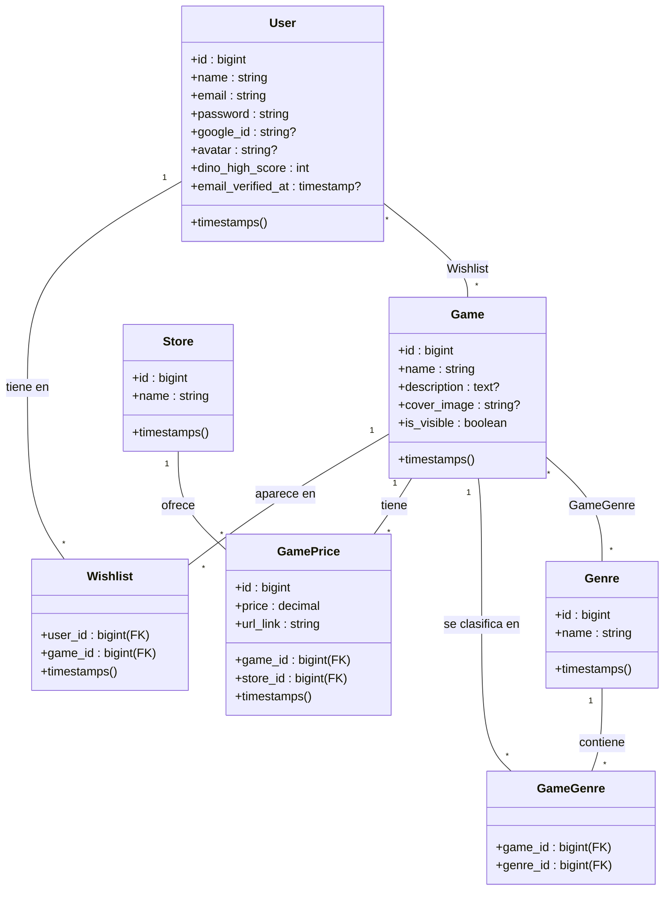

# Diagrama UML de la Base de Datos - PixelMarket

Este documento contiene la representación visual y técnica de la base de datos del proyecto **PixelMarket**, detallando las entidades, sus atributos y las relaciones entre ellas.

## Modelo de Clases (Mermaid)

## Descripción de las Entidades

### 1. Usuarios (`users`)
Gestiona la autenticación y el perfil del usuario.
- Soporta inicio de sesión tradicional y **Google OAuth**.
- Almacena el `dino_high_score` para el minijuego integrado.

### 2. Videojuegos (`games`)
La entidad central del catálogo.
- Contiene metadatos como el nombre, descripción y la imagen de portada.
- El campo `is_visible` permite al administrador ocultar artículos sin borrarlos.

### 3. Precios y Tiendas (`game_prices` & `stores`)
- **Store:** Almacena los nombres de las tiendas (Steam, Epic, etc.).
- **GamePrice:** Es una tabla relacional que vincula un juego con una tienda, añadiendo el precio actual y el enlace directo de compra extraído por el scraper.

### 4. Géneros (`genres`)
Define las categorías de los juegos. Se relaciona con los juegos mediante una tabla pivote (`game_genre`), permitiendo que un juego tenga múltiples etiquetas (ej: "Acción", "Aventura", "RPG").

### 5. Lista de Deseos (`wishlists`)
Relación muchos a muchos que permite a los usuarios guardar sus juegos preferidos para consultas rápidas.
